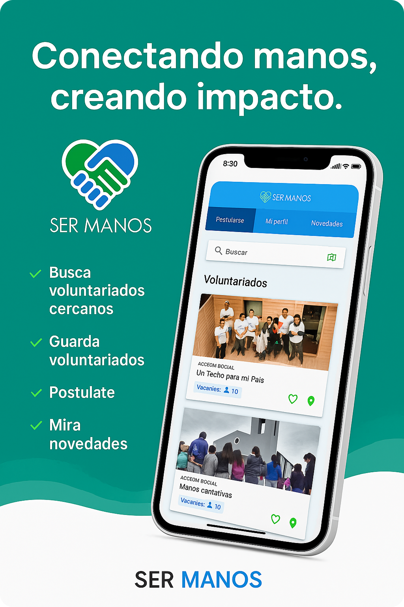

# Ser Manos - Voluntariado App



## Table of Contents

- [1. Introduction](#1-introduction)
- [2. Project Objective and Structure](#2-project-objective-and-structure)
- [3. Features Implemented](#3-features-implemented)
    - [3.1. Core Functional Requirements](#31-core-functional-requirements)
    - [3.2. Special Features](#32-special-features)
- [4. Technical Specifications and Decisions](#4-technical-specifications-and-decisions)
    - [4.1. Architecture and State Management](#41-architecture-and-state-management)
    - [4.2. Deep Links and Routing](#42-deep-links-and-routing)
    - [4.3. Backend Integration](#43-backend-integration)
    - [4.4. Testing Strategy](#44-testing-strategy)
    - [4.5. Monitoring and Events](#45-monitoring-and-events)
    - [4.6. Security and Portability](#46-security-and-portability)
    - [4.7. Data Models](#47-data-models)
    - [4.8. Project Structure](#48-project-structure)
    - [4.9. Dependencies (pubspec.yaml)](#49-dependencies-pubspecyaml)
- [5. Installation and Setup](#5-installation-and-setup)
- [6. Running the Application](#6-running-the-application)
- [7. Development Team](#7-development-team)
- [8. Acknowledgements](#8-acknowledgements)
- [9. License](#9-license)

---

## 1. Introduction

This repository contains the source code for **Ser Manos**, a cross-platform
mobile application developed for the _73.21 - Desarrollo de Aplicaciones Móviles
Multiplataforma_ course at ITBA. The application aims to connect users with
volunteer opportunities near their location, allowing them to browse, search,
and apply for volunteer activities.

## 2. Project Objective and Structure

The primary objective of Ser Manos is to develop a user-friendly cross-platform
mobile application that enables users to easily find and apply for volunteer
opportunities based on their location and interests, following robust UX/UI
design patterns.

## 3. Features Implemented

### 3.1. Core Functional Requirements

The application includes the following core functionalities:

- **User Authentication:** Users can register and log in using their email and
  password.
- **Cross-Platform Compatibility:** The app functions correctly on both Android
  and iOS devices, ensuring a consistent user experience across platforms.
- **Volunteer Opportunity Exploration:** Users can browse available volunteer
  opportunities. Each opportunity includes:
    - An image
    - Volunteer type (e.g., social action)
    - Title
    - Mission/Purpose
    - Activity details
    - Geographical coordinates for location
    - Address
    - Rich text requirements for participation (supporting Markdown)
    - Creation date
    - Available slots
    - Opportunities are ordered by proximity to the user (if location access is
      granted) and by creation date (newest to oldest).
    - Users can mark volunteer opportunities as favorites, which are persisted in
      the backend.
    - Location icons within volunteer cards can open Google Maps via a deep link
      with the selected coordinates.
    - Volunteer opportunities can be searched by title, mission/purpose, and
      activity details.
- **Volunteer Opportunity Details:** Users can view detailed information about
  each volunteer opportunity. There is a tappable map widget that will open the
  device's native map application with the selected coordinates.
- **Volunteer Application:** Users can apply for volunteer opportunities of
  interest. Applications are only possible if the user's profile is complete,
  they are not currently applied to another volunteer opportunity, and there are
  available slots.
- **User Profile:** Users can view and complete their profile.
- **News Section:** Users can view a list of news items, ordered by creation
  date. News items can be shared, including the news image and subtitle.
- **Maps Integration:** Users can access directions on how to get to the
  volunteer location using the users native maps application.

### 3.2. Special Features

As per the assignment, our group implemented the following two special
functionalities:

### 3.2.1. Real-Time Updates

**Description:**  
The application is built around real-time data synchronization using **Cloud
Firestore**. This ensures that users always see the most up-to-date information
across all major areas of the app without needing to refresh manually. Whether
browsing opportunities, reading news, or checking their user profile, data
updates are reflected instantly in the UI.

**Technical Implementation & Decisions:**

- **Technology Choice:**
    - **Cloud Firestore** was selected for its native support for real-time
      listeners and easy integration with Flutter’s reactive widget system.
    - **Riverpod** is used to manage state and expose Firestore streams to the UI
      in a modular and testable way.

- **Usage Across the App:**
    - **Volunteer Opportunities (`voluntariados`):** Real-time streams update
      availability, details, and filtering results as new opportunities are added
      or updated.
    - **News (`novedades`):** A live feed of updates allows users to receive the
      latest news without polling.
    - **Users:** Profile data, postulations, and interaction states (e.g., likes,
      onboarding progress) are synced via document listeners.
    - **Location-Aware Data:** Opportunities are sorted dynamically by proximity
      using `Geolocator`, reacting in real-time to both user movement and database
      changes.

- **Implementation Highlights:**
    - Streams are exposed via `StreamProvider`s and managed in service classes.
      For example:

      ```dart
      Stream<User> watchOne(String userId) =>
          _users.doc(userId).snapshots().map((doc) => User.fromJson(doc.data()!));
  
      Stream<List<Novedad>> watchAll() =>
          _collection.orderBy('createdAt', descending: true).snapshots()
                     .map((snap) => snap.docs.map((d) => Novedad.fromJson(d.data())).toList());
      ```

    - These streams drive the reactive UI, ensuring updates like slot
      availability, news items, and user state (e.g., onboarding, postulation
      status) are reflected immediately.

- **Crash Reporting & Logging:**
    - All service-layer operations are wrapped with **Firebase Crashlytics** and
      **Analytics** for error tracking and observability. Errors in real-time
      updates (e.g., permission issues, invalid states) are logged with relevant
      context.

- **Benefits of Real-Time Architecture:**
    - **No polling or refresh logic**—Firestore pushes changes directly to the
      client.
    - **Optimized performance**—updates are granular and batched efficiently by
      Firestore.
    - **Highly reactive UI**—users see changes reflected across tabs and screens
      immediately.
    - **Developer efficiency**—a consistent pattern (stream + provider + model) is
      used across all entities.

### 3.2.2. Push Notifications

**Description:**  
The app delivers foreground push notifications with deep linking to enhance user
engagement and immediacy for critical events. These include:

- Updates on a volunteer application’s status (accepted or rejected), linking to
  the relevant opportunity.
- Announcements of new news items, linking directly to their detail page.

**Technical Implementation & Decisions:**

- **Technology Stack:**
    - **Firebase Cloud Messaging (FCM):** Used to send and route push
      notifications to user devices.
    - **Firebase Cloud Functions (v2):** Implemented to trigger notifications
      automatically based on changes in Firestore data.
    - **`flutter_local_notifications`:** Used to display notifications while the
      app is in the foreground.
    - **`go_router`:** Handles deep linking and in-app navigation based on
      notification payloads.

- **Backend Notification Triggers:**
    - Implemented using **Firebase Cloud Functions (v2)** with **Firestore
      triggers**:
        - `onDocumentUpdated` listens for changes in user documents. When a user’s
          volunteer application status (`estado`) changes, a personalized FCM
          notification is sent.
        - `onDocumentCreated` listens for new entries in the `novedades` collection.
          When a news item is added, a broadcast notification is sent to all users
          with valid FCM tokens.
    - Each function sends structured FCM payloads including metadata (`type`,
      `voluntariadoId`, `newsId`) used for routing.

- **Client-Side Notification Handling:**
    - Foreground messages are intercepted by `flutter_local_notifications`,
      displaying native push UI elements.
    - A custom `NotificationService` handles:
        - Initialization of local notification channels.
        - Parsing of incoming payloads.
        - Navigating the user via `go_router` to appropriate screens (e.g.,
          `/voluntariado/{id}` or `/novedad/{id}`).

- **Example Payloads:**

```json
{
  "type": "postulation_status",
  "voluntariadoId": "abc123"
}
```

```json
{
  "type": "news",
  "newsId": "xyz789"
}
```

### 🔔 How to Test Push Notifications

Notifications can **only be tested on Android devices**.

The backend listens for two types of events:

- **Application Status Change:**  
  Find the user's `voluntariados` field in Firestore. Change the `estado` field from `"pending"` to either `"accepted"` or `"rejected"` to simulate the application process and trigger a notification.

- **New Novedad Created:**  
  Adding a new document to the `novedades` collection triggers a "news" notification.

#### 📢 Steps to Trigger a News Notification Manually

1. Go to the [Firebase Console](https://console.firebase.google.com/)
2. Select your project and navigate to **Firestore Database**
3. Click on the **`novedades`** collection
4. Click **"Add Document"**
5. Fill in the required fields based on the `Novedad` model:

| Field         | Type      | Example Value                          |
|---------------|-----------|----------------------------------------|
| `id`          | string    | `mock-id`                              |
| `titulo`      | string    | `Nueva oportunidad de voluntariado`    |
| `resumen`     | string    | `Se abrió un nuevo puesto en XYZ`      |
| `emisor`      | string    | `Equipo de SerManos`                   |
| `imagenUrl`   | string    | `https://example.com/image.jpg`        |
| `descripcion` | string    | `Detalles completos de la novedad...`  |
| `createdAt`   | timestamp | Click the clock icon to set it to now  |

Once saved, the notification should appear on any Android device with the app installed and notification permissions enabled.

#### 3.2.3. Camera

Additionally, to get ahead of future workloads we also implemented Camera
functionality

- **Description:** The application allows users to update their profile picture
  using the native device camera or by selecting an image from the device’s file
  system. This provides a personalized user experience and aligns with modern
  app standards where profile customization is expected.
- **Technical Implementation and Decisions:**
    - **Technology Choice:** We utilized the `image_picker` Flutter plugin, which
      provides a unified API for accessing both the device camera and gallery
      across iOS and Android platforms.
    - **Integration:** A modal bottom sheet is presented when the user opts to
      update their profile picture. It gives the option to either take a new photo
      using the camera or choose an existing one from the gallery. Upon selection,
      the image is compressed and uploaded to Firebase Storage, and the resulting
      download URL is saved to the user's profile document in Cloud Firestore.
    - **Implementation Details:**
        - Permissions for camera and storage access are handled gracefully, using
          platform-specific permission prompts.
        - The selected image is previewed before confirmation, giving users the
          opportunity to cancel or retake.
        - After upload, the app updates the UI reactively using Riverpod to reflect
          the new profile image.

## 4. Technical Specifications and Decisions

This section outlines the technical architecture, key decisions, and libraries
used in the development of Ser Manos.

### 4.1. Architecture and State Management

- **Decision:** We adopted a **Riverpod-based architecture** for state
  management, combined with `flutter_hooks` for managing widget lifecycle and
  local state. This aligns with the requirement to implement a state management
  system using libraries seen in class.
- **Argumentation:** Riverpod was chosen over other state management solutions
  for its compile-time safety, explicit dependency declaration, and testability.
  It eliminates common pitfalls associated with `BuildContext` and allows for
  robust, scalable state management throughout the application. `flutter_hooks`
  complements Riverpod by simplifying widget logic and reducing boilerplate.

### 4.2. Deep Links and Routing

- **Decision:** We implemented a comprehensive routing system using
  **`go_router`**. This library facilitates both internal navigation and
  external deep linking capabilities. This fulfills the requirement to implement
  a routing system for correct deep linking usage.
- **Argumentation:** `go_router` was selected for its declarative routing
  approach, support for nested routes, and its excellent integration with deep
  linking. This allowed us to easily handle incoming links from notifications
  and other external sources, providing a seamless user experience.

### 4.3. Backend Integration

- **Decision:** The application integrates with a **Firebase backend**,
  specifically utilizing **Firebase Authentication**, **Cloud Firestore**, and
  **Firebase Storage**. This meets the requirement for integration with a
  backend containing information about volunteers, news, users, and their
  interactions.
- **Argumentation:** Firebase was chosen for its comprehensive suite of services
  that align perfectly with the application's requirements (user authentication,
  real-time database, file storage). Its ease of integration with Flutter via
  official SDKs significantly accelerated development.
    - **Firebase Authentication** handles user registration and login securely.
    - **Cloud Firestore** persists volunteer opportunities, user profiles, news,
      and user interactions (e.g., favorites). It also powers the real-time
      updates for volunteer vacancies.
    - **Firebase Storage** is used for storing images associated with volunteer
      opportunities and user profile pictures.

### 4.4. Testing Strategy

- **Decision:** The project incorporates both **unit tests** and **golden
  tests**. This fulfills the requirement to write both unit and golden tests for
  delivery.
- **Argumentation:**
    - **Unit Tests:** Unit tests were implemented to validate models, JSON
      converters, Riverpod providers, and Firebase-integrated services. These
      tests cover key business logic such as postulations, likes, login
      functionality, and provider state changes. Firebase behavior was simulated
      using mock and fake libraries including `fake_cloud_firestore`,
      `firebase_auth_mocks`, and `firebase_storage_mocks`. According to the LCOV
      report, the test suite achieves 68% total coverage. Specifically, models and
      converters reached 100%, Firebase services approximately 71%, and providers
      around 52%.
    - **Golden Tests:** Visual regression tests (via golden_toolkit) safeguard UI
      consistency:
        - Atoms & Molecules: AppIcon, AppTextField, SearchField, StatusBar,
          AppButton / ShortButton / AppFloatingButton, VacantsDisplay.
        - Components & Cells: Volunteer cards (CardVoluntariado,
          CardVoluntariadoActual) and CardNovedades.
        - Screens / Wireframes: Home (list & map views), Voluntariado detail (all
          states), Novedad detail, Entry, Login, and Register pages.

To run the tests use:

```bash
dart run build_runner build --delete-conflicting-outputs
fvm flutter test --update-goldens
```

### 4.5. Monitoring and Events

- **Decision:**  
  The application integrates **Firebase Crashlytics** and **Firebase Analytics**
  to ensure robust error monitoring and comprehensive user behavior tracking.

- **Argumentation:**
    - **Firebase Crashlytics:**  
      Provides real-time crash reporting, enabling the development team to
      detect, investigate, and resolve issues that occur in production. With crash
      data (e.g., `app_exception`, `auth_error`), we can prioritize bug fixes
      based on frequency and impact, significantly improving app stability and
      user experience.
    - **Firebase Analytics:**  
      Enables the collection of detailed insights into user interactions and
      navigation flows throughout the app. By tracking custom and automatic
      events, we are able to better understand what users do, how they engage with
      key features, and where they may drop off. The following user actions are
      being tracked as key indicators of engagement and feature usage: 1.
        1. **Volunteer Application**  
           Tracks when a user successfully applies for a volunteer opportunity.  
           This helps assess engagement with the core functionality of the platform
           and identify which types of opportunities users respond to the most.

        2. **Screen View** Automatically records when a user navigates to a screen
           (e.g., `EntryScreen`, `VolunteeringsTab`, `ProfileTab`). This data is
           used to analyze user flows, discover which features are most accessed,
           and improve the visibility or UX of underutilized sections.

        3. **Like Toggle Count** Logs every time a user taps the like button on a
           volunteering opportunity. These interactions reflect user preferences,
           allowing us to surface popular content and enhance recommendation
           strategies in the future.

### 4.6. Security and Portability

- **Security:** The application utilizes secure communication protocols. API
  Keys are not exposed in the repository, and the application is kept updated
  with the latest SDK releases to mitigate security vulnerabilities.
- **Portability:** The codebase is designed to be easily adaptable to different
  platforms (Android and iOS) without significant changes, leveraging Flutter's
  inherent cross-platform capabilities.
- **Privacy:** On iOS, the application requests necessary permissions for App
  Tracking Transparency to comply with privacy guidelines for event tracking.

### 4.7. Data Models

The application utilizes three main data models, implemented using `freezed` for
immutability and `json_serializable` for JSON serialization/deserialization.
These models can be found in the `lib/models/` directory.

- **User Model (`user.dart`):** Represents the application user and their
  volunteer-related states.

  ```pseudocode
  enum VoluntariadoUserState { ... } // States related to user's volunteer participation

  class UserVoluntariado {
      id: String
      estado: VoluntariadoUserState
  }

  class User {
      id: String
      nombre: String
      apellido: String
      email: String
      hasSeenOnboarding: Bool (optional)
      voluntariados: List<UserVoluntariado> (optional) 
      likedVoluntariados: List<String> (optional) 
      telefono: String (optional)
      fechaNacimiento: DateTime (optional)
      genero: String (optional)
      imagenUrl: String (optional)
      fcmToken: String (optional) // Firebase Cloud Messaging token for push notifications
  }
  ```

- **Novedad (News) Model (`novedad.dart`):** Represents a news item.

  ```pseudocode
  class Novedad {
      id: String
      titulo: String
      resumen: String
      emisor: String
      imagenUrl: String
      descripcion: String
  }
  ```

- **Voluntariado (Volunteer Opportunity) Model (`voluntariado.dart`):**
  Represents a volunteer opportunity.

  ```pseudocode
  enum VoluntariadoStatus { ... } 

  class Voluntariado {
      id: String
      nombre: String
      tipo: String
      vacantes: int
      location: LatLng // Geographical coordinates (uses custom converter for Firestore)
      imageUrl: String
      descripcion: String
      resumen: String
      requisitos: String // Markdown-formatted text for requirements
  }
  ```

### 4.8. Project Structure

This project follows a **hybrid architecture** that combines both
**feature-first** and **layer-first** organization:

- **Layer-first**: At the core, the project separates responsibilities by type
  (e.g., `models`, `services`, `providers`, `router`). This makes it easy to
  locate shared logic and maintain consistency.
- **Feature-first**: At the UI level, particularly under `shared/wireframes/`,
  screens are grouped by feature domain (`home`, `perfil`, `novedades`, etc.),
  enabling easier collaboration, testing, and navigation for large teams.

This hybrid approach allows for:

- Centralized and reusable logic (layer-first)
- Modular and scalable UI development (feature-first)

---

#### `main.dart`

The application’s entry point. Initializes Firebase, sets up providers, and
starts the root widget tree.

#### `firebase_options.dart`

Auto-generated Firebase configuration for cross-platform initialization.

---

#### Data and Logic Layers

##### `converters/`

Custom JSON converters to handle Firestore-native types:

- `geoPoint_converter.dart` – Converts Firestore `GeoPoint` to Dart objects.
- `latlng_converter.dart` – Bridges Firestore and Google Maps coordinates.
- `timestamp_converter.dart` – Converts `Timestamp` to `DateTime`.

##### `models/`

Defines immutable domain entities (e.g., `User`, `Voluntariado`, `Novedad`) with
code generation support:

- `.freezed.dart` for immutability and pattern matching.
- `.g.dart` for serialization with `json_serializable`.

##### `providers/`

State and stream management using Riverpod. Each file defines scoped logic for
one concern:

- `user_provider.dart` – Current user, onboarding, postulations.
- `voluntariado_provider.dart` – Volunteer opportunities.
- `auth_provider.dart` – Authentication and session management.

##### `services/`

Application logic and Firestore access:

- `auth_service.dart` – Login and registration.
- `user_service.dart`, `novedad_service.dart`, `voluntariado_service.dart` –
  CRUD and Firestore transactions.
- `notification_service.dart` – Handles FCM + deep link routing.
- `fcm_token_service.dart` – Saves and refreshes user FCM tokens.

---

#### Routing

##### `router/`

Manages route definitions and redirection logic using `go_router`:

- `app_router.dart` – Route table and navigation config.
- `go_router_observer.dart` – Optional observer for analytics or debugging.

---

#### UI Components and Screens

##### `shared/`

Contains all visual components and screen implementations. Organized into atomic
layers for reuse and domain directories for cohesion.

- `atoms/` – Basic, reusable UI elements (icons, text styles).
- `molecules/` – Composite widgets like form fields, buttons, tab bars.
- `cells/` – Mid-level components including cards, forms, and modals.
- `tokens/` – Global design tokens (colors, spacing, typography).
- `wireframes/` – Complete UI screens grouped by app feature/domain:
    - `home/`, `perfil/`, `novedades/`, `voluntariados/`, `ingreso/`, and
      `error/`.

### 4.9. Dependencies (`pubspec.yaml`)

The project uses a robust set of dependencies to support a modular architecture,
seamless Firebase integration, native device features, and a modern Flutter
development experience.

#### Architecture & State Management

- `flutter_hooks`: Hook-based lifecycle management for cleaner widget logic.
- `flutter_riverpod`, `hooks_riverpod`: Scalable, testable state management.
- `go_router`: Declarative, async-friendly routing with deep linking support.

#### Firebase Integration

- `firebase_core`: Required to initialize Firebase.
- `firebase_auth`: Handles email/password authentication.
- `cloud_firestore`: Cloud NoSQL database with real-time support.
- `firebase_storage`: Media upload and retrieval.
- `firebase_messaging`: Push notification system using FCM.
- `firebase_analytics`: Tracks user events and usage patterns.
- `firebase_crashlytics`: Real-time crash reporting and diagnostics.

#### Forms & Validation

- `flutter_form_builder`: Rich form generation framework.
- `form_builder_validators`: Built-in validation rules for common input types.

#### Notifications

- `flutter_local_notifications`: Displays foreground push notifications using
  native styles.

#### Device Access & Media

- `image_picker`: Allows users to take or select images for profiles.
- `permission_handler`: Manages permissions for camera, storage, etc.
- `path`, `path_provider`: Handles file system access for local storage.
- `geolocator`: Gets device location and calculates distances.

#### Maps & External Navigation

- `google_maps_flutter`: Google Maps widget for native integration (planned
  usage).
- `maps_launcher`: Launches map applications with coordinates.
- `url_launcher`: Opens links, phone numbers, or emails in external apps.

#### UI & Display

- `flutter_svg`: Renders SVG vector assets.
- `flutter_markdown`: Renders Markdown content (e.g., news, descriptions).
- `cached_network_image`: Efficient image loading with caching.
- `intl`: Internationalization, formatting dates and numbers.
- `cupertino_icons`: iOS-style icon set.

#### Sharing & External Actions

- `share_plus`: Opens native share dialogs (for sharing news or events).

---

#### Development & Tooling

##### Testing & Mocks

- `flutter_test`, `test`: Flutter unit and widget testing frameworks.
- `mockito`: Mocks for dependency injection and unit tests.
- `fake_cloud_firestore`, `firebase_auth_mocks`, `firebase_storage_mocks`: Mock
  implementations of Firebase services for local testing.
- `network_image_mock`: Mocks network image loading during widget tests.
- `golden_toolkit`: Golden (snapshot) testing for visual regressions.

##### Code Generation & Linting

- `build_runner`: Runs code generators.
- `freezed`, `freezed_annotation`: For immutable data classes and unions.
- `json_serializable`, `json_annotation`: Generates serialization logic.
- `flutter_lints`: Enforces Flutter best practices and static analysis rules.

---

#### Icons & Assets

- `flutter_launcher_icons`: Generates platform-specific app icons from a single
  asset.

## 5. Installation and Setup

To set up the project locally, follow these steps:

1. **Clone the repository:**

   ```bash
   git clone [https://github.com/cijjas/ser_manos.git](https://github.com/cijjas/ser_manos.git)
   cd ser_manos
   ```

2. **Install FVM**
   ```bash
   dart pub global activate fvm
   ```

3. **Add FVM to your shell PATH**
   Add this line to your `.bashrc`, `.zshrc`, or similar:
   ```bash
   export PATH="$PATH":"$HOME/.pub-cache/bin"
   ```

4. **Install the correct Flutter version**

   ```bash
   fvm install
   ```

5. **Install Flutter dependencies:**

   ```bash
   fvm flutter pub get
   ```

6. **Firebase Configuration:**
    - Follow the official Firebase documentation to create a Firebase project.
    - Add your Android and iOS apps to the Firebase project.
    - Download the following config files and place them as described:
        - `android/app/google-services.json`
        - `ios/Runner/GoogleService-Info.plist`
    - Enable the required Firebase services: **Authentication**, **Cloud
      Firestore**, **Storage**, **Messaging**, **Analytics**, and
      **Crashlytics**.
    - Run the FlutterFire CLI to link your app and generate
      `firebase_options.dart`:

      ```bash
      dart pub global activate flutterfire_cli
      flutterfire configure
      ```

    - This will generate `lib/firebase_options.dart` and update your project
      settings.

7. **Code Generation:**
    - Run the build runner to generate necessary files (e.g., for `freezed`,
      `json_serializable`):

      ```bash
      dart run build_runner build --delete-conflicting-outputs
      ```

## 6. Running the Application

To run the application on a simulator or physical device:

1. **Ensure you have a device or emulator running.**
2. **Run the app:**

   ```bash
   fvm flutter run
   ```

## 7. Development Team

- [Iñaki Bengolea](https://github.com/meursault00)
- [Agustin Gutierrez](https://github.com/AgustinGuti)
- [Christian Ijjas](https://github.com/cijjas)

## 8. Acknowledgements

- **ITBA** for providing the special practical assignment and guidance for
  _Desarrollo de Aplicaciones Móviles Multiplataforma_.
- The tutors for their invaluable support and feedback throughout the course:
    - [FrBernad](https://github.com/FrBernad)
    - [glpecile](https://github.com/glpecile)
    - [NicolasRampoldi](https://github.com/NicolasRampoldi)
- The open-source community.

## 9. License

This project is licensed under the MIT License - see the [LICENSE](LICENSE) file
for details.

---
